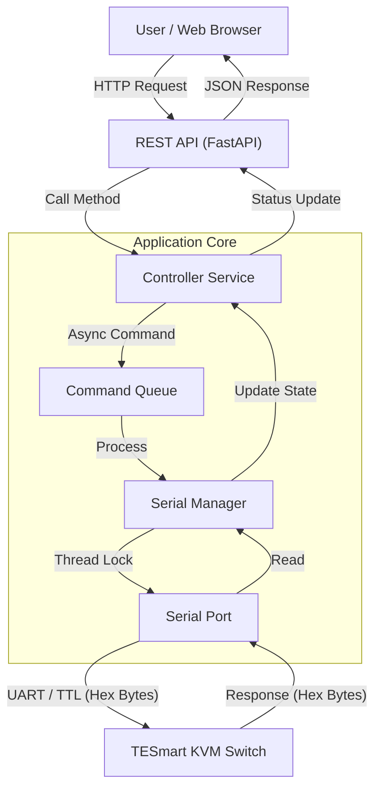

# KVM-as-a-Service

[](https://github.com/gpt559/KVM-as-a-Service/actions/workflows/ci.yml)

A modern, web-based controller for TESmart KVM Switches, designed to run on a **Raspberry Pi** or any Linux environment. This project exposes a REST API and a web interface to control input switching, buzzer settings, and advanced features over a serial connection.

It supports multiple TESmart protocols, including the newer HDC202/X24 series as well as legacy Enterprise and Consumer models.

## 🏗️ Architecture

The system is built as a layered architecture to ensure reliable hardware control over a stateless web protocol.



```text
+----------------+      +------------------+      +---------------------+
|   Web UI       | JSON |     REST API     | Call |  Controller Service |
| (HTML/JS/Pico) | <--> |     (FastAPI)    | <--> | (Logic & State)     |
+----------------+      +------------------+      +---------------------+
                                                            |
                                                            v
                                                  +---------------------+
                                                  |    Serial Manager   |
                                                  | (Thread-Safe I/O)   |
                                                  +---------------------+
                                                            |
                                                            v
                                                  +---------------------+
                                                  |  /dev/ttyUSB0       |
                                                  +---------------------+
                                                            |
                                                       TX / RX (TTL)
                                                            |
                                                            v
                                                  +---------------------+
                                                  | TESmart KVM Switch  |
                                                  |     (Hardware)      |
                                                  +---------------------+
```

## 🚀 Getting Started

### Prerequisites

*   **Hardware**: Raspberry Pi (running Raspberry Pi OS) or Linux Desktop/Server.
*   **Software**: Docker & Docker Compose.
*   **KVM**: A TESmart KVM Switch connected via Serial (USB-to-Serial adapter recommended).

### Hardware Setup

> ⚠️ **CRITICAL HARDWARE WARNING** ⚠️
> *   **DO NOT** use a standard RS-232 cable (±12V levels). This could damage your KVM.
> *   You **MUST** use a **3.3V TTL** USB-to-Serial cable.
> *   **Interface**: 3.5 mm service port (UART with TTL levels).

**Pinout Configuration:**
*   **Pin 3**: TX (Transmit)
*   **Pin 2**: RX (Receive)
*   **Pin 1**: GND (Ground)

1.  Connect your **3.3V TTL USB-to-Serial adapter** to the Raspberry Pi.
2.  Connect the 3.5mm jack to the service port on the KVM.
3.  Identify the port (usually `/dev/ttyUSB0`).

### Installation & Running

1.  **Clone the repository:**
    ```bash
    git clone <repository_url>
    cd KVM-as-a-Service
    ```

2.  **Configure Serial Port:**
    Edit `docker-compose.yml` to match your device path (e.g., `/dev/ttyUSB0`).

3.  **Run with Docker:**
    ```bash
    docker compose up -d --build
    ```

    The service will be available at `http://<your-pi-ip-address>:8000`.

## 📱 Network Access (Control from Phone/Tablet)

Since the service runs in Docker on your Raspberry Pi, it is automatically accessible on your local network.

1.  Find your Pi's IP address: `hostname -I`
2.  Open a browser on your phone/tablet: `http://<pi-ip-address>:8000`

### Windows (WSL 2) Users
If you are developing on Windows using WSL 2, you may need to use our helper script to expose the port to your LAN.
👉 **[Read the Network Access Guide](EXPOSE_NETWORK.md)**

## 🔌 API Usage

The service provides a Swagger UI for interactive documentation and testing.
*   **Docs & Swagger UI:** `http://localhost:8000/docs`

### Core Control
*   **Switch Port:** `POST /api/v1/switch`
    ```json
    {"port": 1}
    ```
*   **Buzzer:** `POST /api/v1/buzzer`
    ```json
    {"state": "off"}
    ```

### Audio & Video
*   **Audio Source:** `POST /api/v1/audio/source`
    ```json
    {"port": 1}
    ```
*   **Audio Follow:** `POST /api/v1/audio/follow`
    ```json
    {"enabled": true}
    ```

### System & Environment
*   **Light Control:** `POST /api/v1/light`
    ```json
    {"mode": "flow"}
    ```
    *Modes: `off`, `basic`, `flow`, `breathing`*
*   **Fan Control:** `POST /api/v1/fan`
    ```json
    {"mode": "auto"}
    ```
    *Modes: `off`, `auto`, `low`, `high`*

### USB & Peripherals
*   **USB Focus:** `POST /api/v1/usb/focus`
    ```json
    {"target": "pc1"}
    ```
*   **USB Compatibility Mode:** `POST /api/v1/usb/compatibility`
    ```json
    {"enabled": true}
    ```
*   **Mouse Middle Button:** `POST /api/v1/usb/mouse-middle`
    ```json
    {"enabled": true}
    ```

### Configuration & Advanced
*   **Update Config:** `POST /api/v1/config`
    ```json
    {
        "protocol": "hdc202_x24",
        "baudrate": 9600,
        "terminator": "none"
    }
    ```
    *Supported Protocols: `enterprise`, `consumer_a`, `consumer_b`, `matrix`, `dual_monitor_hex`, `hdc202_x24`*
*   **Network Power (LAN):** `POST /api/v1/network`
    ```json
    {"port": 1, "enabled": true}
    ```
*   **Auto-Detect:** `POST /api/v1/system/autodetect`
    ```json
    {"enabled": true}
    ```
*   **Auto-Scan:** `POST /api/v1/system/autoscan`
    ```json
    {"enabled": true}
    ```

### Diagnostics & Query
*   **Service Status:** `GET /api/v1/status`
    *Returns health, connection status, and current configuration.*
*   **Send Query:** `POST /api/v1/query`
    ```json
    {"command": "monitor_count"}
    ```
*   **Test Permutations:** `POST /api/v1/test/permutations`
    *Runs a manual test cycle across all baud rates and protocols (Use with caution).*

## 📁 Project Structure

*   `src/`: Application source code (FastAPI).
    *   `main.py`: API Routes.
    *   `controller_service.py`: Logic & State Management.
    *   `serial_manager.py`: Hardware Communication.
    *   `constants.py`: Protocol Definitions.
*   `static/`: Frontend web interface.
*   `scripts/`: Helper scripts for deployment/networking.
*   `ai/specs/`: Project specifications and design documents.

## 📄 License

This project is licensed under the GNU General Public License v3.0 - see the [LICENSE](LICENSE) file for details.
