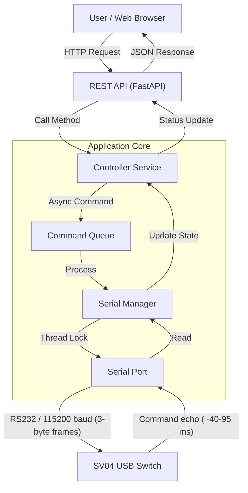

# KVM-as-a-Service

[](https://github.com/gpt559/KVM-as-a-Service/actions/workflows/ci.yml)
[](LICENSE)
[](https://www.python.org/downloads/)
[](https://github.com/astral-sh/ruff)
[](https://github.com/astral-sh/uv)
[](https://github.com/astral-sh/ty)

A modern, web-based controller for an **SV04 4-port USB peripheral switch**, designed to run on a **Raspberry Pi** or any Linux environment. This project exposes a REST API and a streamlined web interface to select which of four inputs owns the shared USB peripherals, over an RS232 serial connection.

> ⚠️ **Operational note:** Switching away from a machine's own input immediately detaches any shared USB peripherals (keyboard, mouse) from that machine.

The backend also retains support for six **TESmart KVM protocols** (`hdc202_x24`, `enterprise`, `consumer_a`, `consumer_b`, `matrix`, `dual_monitor_hex`), accessible via the REST API.

## 🏗️ Architecture

The system is built as a layered architecture to ensure reliable hardware control over a stateless web protocol.



```text
+----------------+      +------------------+      +---------------------+
|   Web UI       | JSON |     REST API     | Call |  Controller Service |
| (HTML/JS/Pico) | <--> |     (FastAPI)    | <--> | (Logic & State)     |
+----------------+      +------------------+      +---------------------+
                                                            |
                                                            v
                                                  +---------------------+
                                                  |    Serial Manager   |
                                                  | (Thread-Safe I/O)   |
                                                  +---------------------+
                                                            |
                                                            v
                                                  +---------------------+
                                                  |  /dev/ttyUSB0       |
                                                  +---------------------+
                                                            |
                                                    TX / RX (RS232)
                                                            |
                                                            v
                                                  +---------------------+
                                                  |  SV04 USB Switch    |
                                                  |     (Hardware)      |
                                                  +---------------------+
```

## 🚀 Getting Started

### Prerequisites

*   **Hardware**: Raspberry Pi 5 (or any Raspberry Pi running Raspberry Pi OS) or Linux Desktop/Server.
*   **Software**: Docker with the Compose v2 plugin (`docker compose`).
*   **Switch**: An SV04 4-port USB peripheral switch connected via RS232 (a USB-to-serial adapter with DB9 connector is required; the verified setup uses an FTDI FT232R).

### Hardware Setup

> ⚠️ **BAUD RATE WARNING** ⚠️
> The SV04 communicates at **115200 baud only**. Sending commands at any other baud rate latches up the switch's RS232 controller until it is **physically power-cycled**. Ensure `BAUD_RATE=115200` and `PROTOCOL=sv04` are set in `docker-compose.yml` before first use.

**Verified hardware rig:** Raspberry Pi 5, FTDI FT232R USB-serial adapter on `/dev/ttyUSB0`, DB9 cable to the SV04's RS232 port.

1.  Connect your **USB-to-serial adapter** (e.g. FTDI FT232R) to the Raspberry Pi USB port.
2.  Connect the adapter's DB9 connector to the RS232 port on the SV04 switch.
3.  Identify the device path (usually `/dev/ttyUSB0`).

### Installation & Running

1.  **Clone the repository:**
    ```bash
    git clone <repository_url>
    cd KVM-as-a-Service
    ```

2.  **Configure Serial Port and Protocol:**
    Edit `docker-compose.yml` to match your device path and verify the SV04 settings:
    *   `SERIAL_PORT=AUTO` (or `/dev/ttyUSB0` explicitly)
    *   `BAUD_RATE=115200`
    *   `PROTOCOL=sv04`

    > **Note:** This project uses Docker Compose v2 (`docker compose`). The v1 `docker-compose` binary is not installed on the verified setup; the header comments in `docker-compose.yml` still show v1-style commands, which should be ignored.

3.  **Run with Docker:**
    ```bash
    docker compose up -d --build
    ```

    The service will be available at `http://<your-pi-ip-address>:8000`.

## 📱 Network Access (Control from Phone/Tablet)

Since the service runs in Docker on your Raspberry Pi, it is automatically accessible on your local network.

1.  Find your Pi's IP address: `hostname -I`
2.  Open a browser on your phone/tablet: `http://<pi-ip-address>:8000`

### Windows (WSL 2) Users
If you are developing on Windows using WSL 2, you may need to use our helper script to expose the port to your LAN.
👉 **[Read the Network Access Guide](EXPOSE_NETWORK.md)**

## 🖥️ Web Interface

Open `http://<pi-ip-address>:8000` in a browser to access the web UI. It presents four input buttons (1–4). Clicking a button sends a switch command and waits for the hardware confirmation echo from the SV04 (~40–95 ms); the active-port indicator updates only after the hardware responds. The UI is read-only with respect to configuration — there are no protocol, baud rate, or terminator controls.

## 🔌 API Usage

The service provides a Swagger UI for interactive documentation and testing.
*   **Docs & Swagger UI:** `http://localhost:8000/docs`
*   **Full API Reference:** [`docs/API.md`](docs/API.md)

### Core Control
*   **Switch Input:** `POST /api/v1/switch`
    ```json
    {"port": 1}
    ```
    *Ports 1–4 for SV04. A `200` response means hardware-confirmed (the SV04 echoes the command before the API responds). Ports 1–8 are accepted for TESmart KVM protocols.*
*   **Buzzer:** `POST /api/v1/buzzer` *(TESmart KVM protocols only)*
    ```json
    {"state": "off"}
    ```

### Audio & Video *(TESmart KVM protocols only)*
*   **Audio Source:** `POST /api/v1/audio/source`
    ```json
    {"port": 1}
    ```
*   **Audio Follow:** `POST /api/v1/audio/follow`
    ```json
    {"enabled": true}
    ```

### System & Environment *(TESmart KVM protocols only)*
*   **Light Control:** `POST /api/v1/light`
    ```json
    {"mode": "flow"}
    ```
    *Modes: `off`, `basic`, `flow`, `breathing`*
*   **Fan Control:** `POST /api/v1/fan`
    ```json
    {"mode": "auto"}
    ```
    *Modes: `off`, `auto`, `low`, `high`*

### USB & Peripherals *(TESmart KVM protocols only)*
*   **USB Focus:** `POST /api/v1/usb/focus`
    ```json
    {"target": "pc1"}
    ```
*   **USB Compatibility Mode:** `POST /api/v1/usb/compatibility`
    ```json
    {"enabled": true}
    ```
*   **Mouse Middle Button:** `POST /api/v1/usb/mouse-middle`
    ```json
    {"enabled": true}
    ```

### Configuration & Advanced
*   **Update Config:** `POST /api/v1/config`
    ```json
    {
        "protocol": "sv04",
        "baudrate": 115200,
        "terminator": "none"
    }
    ```
    *Supported Protocols: `sv04`, `enterprise`, `consumer_a`, `consumer_b`, `matrix`, `dual_monitor_hex`, `hdc202_x24`*

    > ⚠️ For `sv04`, `baudrate` must always be `115200`. Any other value latches up the switch's RS232 controller until power-cycled. For normal use, configure via `docker-compose.yml` environment variables (`PROTOCOL=sv04`, `BAUD_RATE=115200`) — these are applied at service startup automatically.
*   **Network Power (LAN):** `POST /api/v1/network` *(TESmart KVM protocols only)*
    ```json
    {"port": 1, "enabled": true}
    ```
*   **Auto-Detect:** `POST /api/v1/system/autodetect` *(TESmart KVM protocols only)*
    ```json
    {"enabled": true}
    ```
*   **Auto-Scan:** `POST /api/v1/system/autoscan` *(TESmart KVM protocols only)*
    ```json
    {"enabled": true}
    ```

### Diagnostics & Query
*   **Service Status:** `GET /api/v1/status`
    *Returns health, connection status, and current configuration.*
*   **Send Query:** `POST /api/v1/query` *(TESmart KVM protocols only — SV04 does not support queries)*
    ```json
    {"command": "monitor_count"}
    ```

## 📁 Project Structure

*   `src/`: Application source code (FastAPI).
    *   `main.py`: API Routes.
    *   `controller_service.py`: Logic & State Management.
    *   `serial_manager.py`: Hardware Communication.
    *   `constants.py`: Protocol Definitions.
    *   `probe_switch.py`: Hardware verification tool; run `python -m src.probe_switch --confirm` (also supports `--loopback` and `--hold-tx`). Stop the service container first — it holds `/dev/ttyUSB0`.
*   `static/`: Frontend web interface (SV04 input selector).
*   `docs/`: External-facing documentation (`API.md` — full REST API reference).
*   `scripts/`: Helper scripts for deployment/networking.
*   `ai/specs/`: Project specifications and design documents.

## 📄 License

This project is licensed under the GNU General Public License v3.0 - see the [LICENSE](LICENSE) file for details.
