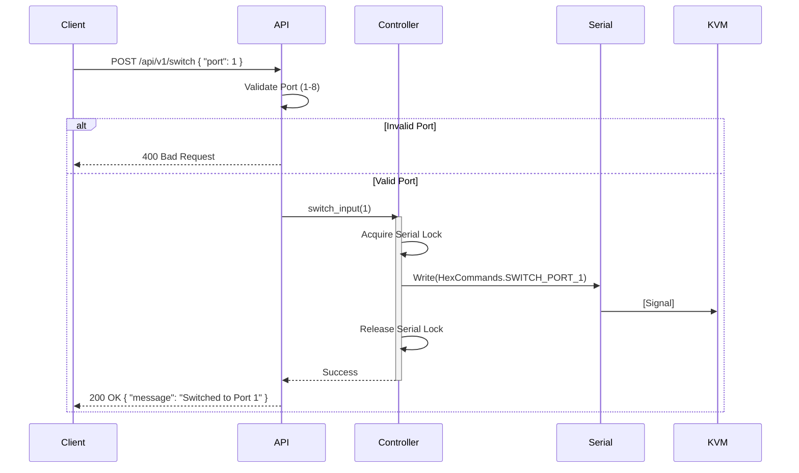
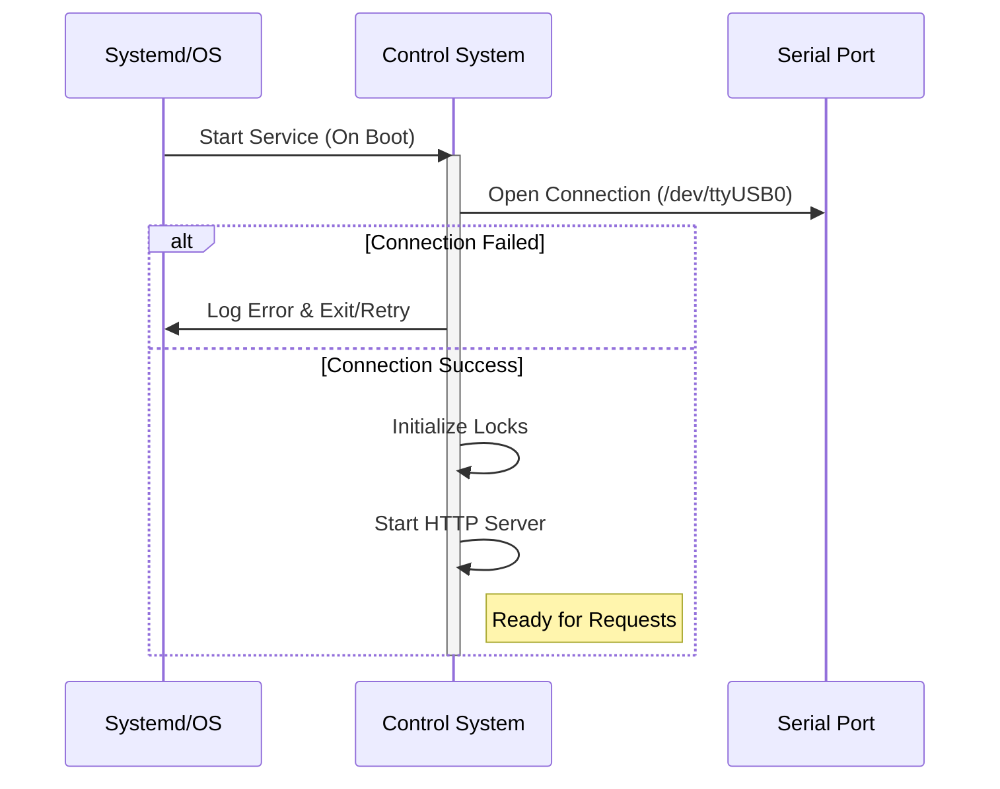

# Technical Design: KVM-as-a-Service

## System Architecture

The system follows a layered architecture designed to decouple the network interface from the low-level hardware communication.

### Components

1.  **API Layer (Interface)**
    *   **Role**: Entry point for external clients (automation scripts, monitoring tools).
    *   **Technology**: HTTP REST Server (Python/FastAPI).
    *   **Responsibilities**: Request validation, routing, authentication (future scope), and response formatting.

2.  **Controller Service (Business Logic)**
    *   **Role**: The core application logic.
    *   **Responsibilities**: Managing the application state, translating high-level intents (e.g., "Switch to Port 1") into low-level bytes, and enforcing the "single access" rule for the serial port.

3.  **Hardware Abstraction Layer (HAL)**
    *   **Role**: Direct interface with the Serial Port.
    *   **Technology**: `pyserial`.
    *   **Responsibilities**: Opening/closing the serial connection, writing hex bytes, and handling serial-level exceptions (timeouts, disconnects).

4.  **Physical Hardware**
    *   **Role**: The KVM Switch connected via RS-232/USB-Serial.

### High-Level Diagram


---

## Data Models/Schemas

We will use strict typing (Pydantic models) to ensure request validity before they reach the hardware layer.

### 1. API Models

**Request: Switch Input**
```python
class SwitchRequest(BaseModel):
    port: int = Field(..., ge=1, le=8, description="Target Port ID (1-8)")
```

**Request: Buzzer Control**
```python
class BuzzerRequest(BaseModel):
    state: Literal["on", "off"]
```

**Response: Standard Success**
```python
class SuccessResponse(BaseModel):
    status: str = "success"
    message: str
    timestamp: datetime
```

**Response: Error**
```python
class ErrorResponse(BaseModel):
    status: str = "error"
    code: str  # e.g., "INVALID_PORT", "DEVICE_OFFLINE"
    detail: str
```

### 2. Internal Command Enums

Mapping high-level actions to hex payloads.

```python
class HexCommands(Enum):
    # Example payloads based on common KVM protocols (to be verified with specific hardware manual)
    SWITCH_PORT_1 = b'\xAA\xBB\x03\x01\x01\xEE'
    SWITCH_PORT_2 = b'\xAA\xBB\x03\x01\x02\xEE'
    BUZZER_ON     = b'\xAA\xBB\x03\x02\x01\xEE'
    BUZZER_OFF    = b'\xAA\xBB\x03\x02\x00\xEE'
```

---

## Sequence Diagrams

### 1. Switch Input Flow



### 2. System Startup (Service Persistence)



---

## Design Decisions

### 1. Technology Stack: Python + FastAPI
*   **Why Python?**: Python has the most robust and mature library for serial communication (`pyserial`). It is pre-installed in the environment (devcontainer) and excellent for system-level scripting.
*   **Why FastAPI?**: It provides automatic OpenAPI documentation (Swagger UI), which is crucial for "System Availability" checks and allowing developers to easily test the API. It also handles Pydantic validation out of the box.

### 2. Concurrency Model: Thread Locking
*   **Problem**: Serial ports are exclusive resources. Two simultaneous HTTP requests could try to write to the serial port at the same time, resulting in corrupted data streams.
*   **Solution**: A global `threading.Lock()` will be used in the Controller layer. The API is async (non-blocking for networking), but the actual hardware write operation will be wrapped in a synchronous critical section.

### 3. Error Handling Strategy
*   **Hardware Failures**: If the serial cable is unplugged, the write operation will raise an exception. The system will catch this `SerialException` and return a `503 Service Unavailable` rather than crashing, satisfying the requirement to report system errors.

### 4. Deployment: Containerization (Docker)
*   **Requirement**: "Run in a docker container"
*   **Solution**: We will containerize the application using a lightweight Python base image (e.g., `python:3.9-slim`).
    *   **Dockerfile**: Defines the environment, installs dependencies, and sets the entrypoint.
    *   **Device Access**: The container needs access to the host's serial port. This is achieved using the `--device` flag (e.g., `--device=/dev/ttyUSB0:/dev/ttyUSB0`) when running the container.
    *   **Persistence**: Docker Restart Policies (`--restart unless-stopped`) will be used to ensure the service runs on boot and recovers from crashes.

---

## Security & Performance

### Security
1.  **Input Sanitization**: Pydantic models strictly enforce integer ranges for Ports. This prevents arbitrary data from being sent to the serial port buffer.
2.  **Network Binding**: By default, the service should bind to `0.0.0.0` to be accessible, but in production, firewall rules (UFW) should restrict access to authorized subnets (management VLANs).
3.  **No Auth (MVP)**: Per requirements, no authentication is explicitly requested, but the architecture (FastAPI dependencies) allows easy injection of an API Key check middleware later.

### Performance
1.  **Latency**: Serial communication is slow (baud rates like 9600). The API will block momentarily during the write. We expect response times < 200ms.
2.  **Queueing**: If multiple automation scripts hit the service simultaneously, the `threading.Lock` will queue them naturally.
3.  **Keep-Alive**: The Serial connection will be kept open ("persistent handle") as per requirements, rather than opening/closing on every request. This reduces latency and wear on the OS file handle table.
